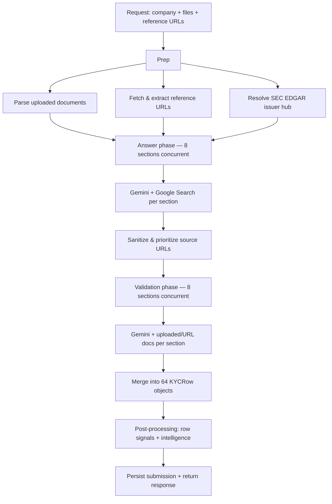

# KYC Automation — Application Overview & Backend Architecture

This document describes what the **Tiger Analytics KYC Automation Platform** is, how analysts use it at a high level, and how the **FastAPI backend** is structured today.

---

## What this application is

The KYC Automation platform is a **prototype for commercial banking compliance workflows**. It helps analysts accelerate Know Your Customer (KYC) / Know Your Business (KYB) due diligence by combining:

1. **Client-provided inputs** — company name, uploaded documents (PDF, DOCX, images), and optional reference URLs.
2. **AI-assisted research** — Google Gemini with live web search fills a structured **64-question KYC questionnaire** organized into **8 sections**.
3. **Document validation** — a second AI pass checks whether uploaded materials support each proposed answer.
4. **Analyst review** — results are editable, annotatable, exportable, and persistable to **History** for later pickup.

The system is designed as a **human-in-the-loop assistant**, not a fully autonomous decision engine. Analysts still triage uncertainty, correct answers, add comments, sign off, and hand off evidence to downstream teams.

### Primary user journey

```
Landing page  →  New KYC run  →  Processing  →  Results table  →  Export / History
     /              /kyc           (async)         (64 rows)        (CSV/PDF/JSON)
```

An alternative entry point is a **gated intake link** (`/intake/{token}`), which forwards the client into the same workflow with server-side token validation.

### The KYC questionnaire

The questionnaire is fixed and canonical — **64 questions across 8 sections**:

| Section | Topic |
|--------:|-------|
| 1 | Legal Identity |
| 2 | Ownership & Ultimate Beneficial Owner |
| 3 | Business Activities |
| 4 | Financial & Banking |
| 5 | Risk & Compliance |
| 6 | Source of Funds |
| 7 | Declarations & Consents |
| 8 | Additional Information |

Each completed row includes an **answer**, **web sources** (citation links from research), **validation** (`Yes` / `No` / empty), **validation sources** (document filename, page, excerpt), and fields for **analyst comments** and workflow metadata.

### Frontend (context only)

The UI is a **React + TypeScript SPA** (Vite, shadcn-ui, Tailwind) under `src/`. It talks to the backend via `/api/*` — proxied to FastAPI in local dev and through nginx in Docker Compose. This document focuses on the backend; the frontend is the presentation and workflow layer for the same API contract.

---

## Backend architecture

The backend is a **single FastAPI service** (`backend/app/main.py`) deployed with Uvicorn. It follows a layered design:

```
┌─────────────────────────────────────────────────────────────┐
│  HTTP layer          app/routes/                            │
│  (process, history, intake, narrative)                      │
├─────────────────────────────────────────────────────────────┤
│  Orchestration       app/services/pipeline.py               │
│                      app/services/pipeline_jobs.py          │
├─────────────────────────────────────────────────────────────┤
│  Domain services     answer_section, validate_section,      │
│                      documents, reference_urls,             │
│                      sec_filings_hub, kyc_intelligence, …   │
├─────────────────────────────────────────────────────────────┤
│  Data layer          app/db/ (SQLAlchemy async + Postgres)  │
│                      app/services/blob_storage.py (Blob)    │
├─────────────────────────────────────────────────────────────┤
│  External APIs       Google Gemini (google-genai)           │
│                      SEC EDGAR / data.sec.gov               │
│                      User-supplied HTTPS reference URLs     │
└─────────────────────────────────────────────────────────────┘
```

### Application entry point

`app/main.py` wires:

- **Lifespan hooks** — initialize and dispose the async Postgres connection on startup/shutdown.
- **Middleware** — CORS (configurable allow-list) and request logging.
- **Routers** — four route modules mounted under `/api`.
- **Health check** — `GET /api/health`.

Configuration is split intentionally:

- **Secrets** (API keys, DB password, Blob token) come from environment variables / `.env`.
- **Tuning** (model IDs, concurrency, validation limits, CORS origins) lives in `app/config.py` module constants.

---

## Core processing pipeline

The heart of the backend is `app/services/pipeline.py` → `run_pipeline()`. Every process request (sync or async) flows through this orchestrator.

### Pipeline phases



#### 1. Prep

In parallel:

- **`parse_documents`** — extract text from PDFs (PyPDF), DOCX (python-docx), and images (Pillow); prepare native attachments for validation when enabled.
- **`ingest_reference_urls`** — server-side fetch of user-supplied HTTPS URLs (size/timeout limits apply); content is treated as additional validation material.
- **`resolve_sec_filings_hub`** — match the company name against SEC `company_tickers.json`, resolve CIK, and build EDGAR browse/filing hints that steer the answer model toward authoritative filings.

#### 2. Answer phase (web research)

For each of the 8 sections, **`answer_section`** makes one or more Gemini `generate_content` calls with:

- **Google Search grounding** enabled (mandatory web research).
- **Structured JSON output** (schema enforced on Gemini 3+ models).
- Section-specific prompts including evidence hierarchy instructions and SEC filing recency guidance.

All 8 section calls run **concurrently**, bounded by `ANSWER_CONCURRENCY` (default: 8) and optional inter-call delay for rate limiting.

After answers return:

- **`sanitize_answer_sources_urls`** — verify/repair citation URLs (especially SEC Archives links).
- **`prioritize_and_cap_answer_sources`** — rank sources by domain priority (regulators, gov domains first) and cap to a small number per row.

#### 3. Validation phase (document cross-check)

For each section, **`validate_section`** sends Gemini:

- The proposed answers from the answer phase.
- Parsed document content (uploads + fetched reference URLs).

Validation decides per question whether the materials **support** the answer (`Yes` / `No`) and, when `Yes`, returns document filename, page, excerpt, and URL where applicable.

Validation runs **concurrently** with a separate semaphore (`VALIDATION_CONCURRENCY`, default: 2) because document payloads are heavier. Large PDFs may be sharded via `document_sharding.py` to stay within Gemini context limits.

#### 4. Merge & post-processing

Answers and validations are keyed by global serial number (1–64) and assembled into `KYCRow` Pydantic models (`app/schemas.py`).

Optional post-steps (failures here do **not** fail the pipeline):

- **`annotate_pipeline_rows`** — confidence/staleness signals on rows.
- **`build_pipeline_intelligence`** — screening stub, playbook rule evaluation, registry hints, optional structured entity extract, and a suggested risk tier.

#### Error recovery

If a section fails during answer or validation, the pipeline **does not abort entirely**. It records a `PipelineSectionError` (section number, phase, message, error ID) and inserts placeholder answers for that section so the analyst still receives a partial result.

---

## API surface

All routes are under `/api` and grouped by concern:

### Process (`app/routes/process.py`)

| Endpoint | Purpose |
|----------|---------|
| `POST /api/process` | Synchronous full pipeline run |
| `POST /api/process/async` | Start background job; returns `jobId` |
| `GET /api/process/jobs/{jobId}` | Poll job status, progress, and final result |
| `POST /api/process/jobs/{jobId}/cancel` | Request cancellation |
| `POST /api/process/rerun` | Re-run pipeline for a saved submission with new/edited attachments and URLs |
| `POST /api/process/rerun/async` | Async variant of rerun |

The frontend typically uses the **async** endpoints so it can show live progress (prep → answer sections 1–8 → validate sections 1–8 → done).

Process requests accept **multipart form data**:

- `company_name` (required)
- `files` (optional uploads)
- `reference_urls` (optional, repeated form fields)
- `intake_token` (optional, validated against Postgres when present)

### History (`app/routes/history.py`)

Persists and retrieves completed runs when Postgres is configured:

| Endpoint | Purpose |
|----------|---------|
| `GET /api/history` | Paginated list with completion metrics |
| `GET /api/history/{id}` | Full submission detail (64 rows + metadata) |
| `GET /api/history/{id}/attachments/download` | Authorized stream from Vercel Blob |
| `GET/PUT /api/history/{id}/metadata` | Analyst sign-off, notes, escalations, workflow state |
| `POST /api/history/{id}/metadata/audit` | Append audit log entries |
| `GET /api/entity-resolution/similar` | Fuzzy match on prior company names |
| `GET /api/history/{id}/qa-sample` | Random serials for QA spot-checks |

When the database is unavailable, history endpoints degrade gracefully (empty list) or return 503 where persistence is required.

### Intake (`app/routes/intake.py`)

| Endpoint | Purpose |
|----------|---------|
| `POST /api/intake/tokens` | Mint a shareable intake token |
| `GET /api/intake/tokens/{token}` | Validate token and return label |

Tokens gate who may submit via the public SPA without full authentication.

### Narrative (`app/routes/narrative.py`)

| Endpoint | Purpose |
|----------|---------|
| `POST /api/narrative` | Generate a compliance narrative summary from rows or a saved submission |

Uses Gemini via `narrative_summarizer.py`.

---

## Data & storage

### PostgreSQL (optional but required for full features)

Async SQLAlchemy (`app/db/session.py`) connects when `DATABASE_URL` or `DATABASE_PASSWORD` (with `PG*` host settings) is set. Defaults target AWS RDS (`aws-apg-erin-house`); override via `PGHOST`, `PGPORT`, `PGUSER`, `PGDATABASE`, `PGSSLMODE`. Tables:

| Table | Purpose |
|-------|---------|
| `kyc_submissions` | One row per pipeline run: company name, 64 questionnaire rows (JSONB), attachment metadata, reference URLs, duration, pipeline intelligence |
| `kyc_submission_metadata` | Analyst workflow: sign-off, notes, audit log, escalated serials, workflow state |
| `kyc_intake_tokens` | Opaque tokens for gated client intake links |

Postgres is **required** when:

- Uploading documents (metadata authorizes downloads).
- Validating intake tokens.
- Using History, metadata, or rerun-from-submission flows.

### Object storage — Vercel Blob (optional but required for uploads)

Uploaded files are stored in a Vercel Blob store (private recommended) via `app/services/blob_storage.py`. Pathnames are scoped per submission UUID (`kyc/{submission_id}/…`). Downloads are authorized in the API, then streamed from Blob with `BLOB_READ_WRITE_TOKEN`.

Env vars: `BLOB_READ_WRITE_TOKEN`, optionally `BLOB_STORE_ID`.

### In-memory job registry

Async process jobs (`app/services/pipeline_jobs.py`) track status, phase, progress payloads, cancellation events, and final results **in process memory**. This suits single-instance deployments; a multi-instance setup would need an external job store.

---

## Key service modules

| Module | Role |
|--------|------|
| `pipeline.py` | End-to-end orchestration of prep → answer → validate → merge |
| `answer_section.py` | Per-section Gemini answer calls with Google Search |
| `validate_section.py` | Per-section document validation calls |
| `documents.py` | Parse uploads into text and native attachment parts |
| `reference_urls.py` | Fetch and normalize user-supplied URLs |
| `sec_filings_hub.py` | SEC EDGAR issuer resolution and filing hints |
| `source_urls.py` | Sanitize, verify, prioritize, and cap citation URLs |
| `document_sharding.py` | Split large documents for validation context limits |
| `gemini_client.py` | Shared Gemini client, retry/backoff on overload, JSON parsing |
| `gemini_schemas.py` | JSON schemas for structured model responses |
| `kyc_intelligence.py` | Assemble screening, playbook, registry hints, structured extract |
| `playbook_eval.py` | Evaluate YAML playbook rules against completed rows |
| `kyc_row_signals.py` | Annotate rows with confidence/staleness metadata |
| `narrative_summarizer.py` | Compliance narrative generation |
| `pipeline_jobs.py` | In-memory async job tracking and progress callbacks |
| `blob_storage.py` | Upload files and fetch blobs for authorized downloads |

The canonical question list lives in `app/questions.py` (mirrored on the frontend in `src/data/kycQuestions.ts`). Playbook rules are in `backend/config/kyc_playbook.yaml` and reload on process start.

---

## Concurrency, resilience, and limits

- **Answer concurrency**: 8 parallel section calls (configurable).
- **Validation concurrency**: 2 parallel section calls (heavier payloads).
- **Overload retry**: Gemini 503/overload responses retry with exponential backoff.
- **Reference URLs**: capped per request (default 20), with per-URL size and timeout limits.
- **Validation budgets**: PDF/image byte limits, text char limits, and optional chunk retrieval for very large document sets.
- **Source URL verification**: optional HTTP probes to repair broken SEC citation links.
- **Cancellation**: async jobs honor a cancel event between major phases; validation may be skipped if cancelled during answer phase.

---

## Deployment topology

Typical production layout (Docker Compose):

```
Browser  →  nginx (frontend container, :8080)
              ├── static React build
              └── /api/* proxied to backend:8000

Backend (FastAPI/Uvicorn, :8000)
  ├── Gemini API
  ├── Postgres (AWS RDS via Vercel integration)
  └── Vercel Blob object storage
```

The frontend can also deploy separately (e.g. Cloudflare Workers via `wrangler.jsonc`) with `VITE_API_BASE_URL` pointing at the API host. CORS origins must include the UI origin in `app/config.py`.

---

## Configuration summary

| Category | Where | Examples |
|----------|-------|----------|
| Secrets | `.env` | `GEMINI_API_KEY`, `DATABASE_PASSWORD`, `BLOB_READ_WRITE_TOKEN` |
| Models & tuning | `app/config.py` | `GEMINI_MODEL_ANSWER`, `GEMINI_MODEL_VALIDATION`, concurrency, validation limits |
| Playbook rules | `backend/config/kyc_playbook.yaml` | Policy-style checks surfaced to analysts |
| CORS | `app/config.py` | `CORS_ALLOWED_ORIGINS` |

---

## Design principles (current state)

1. **Section-parallel LLM calls** — The 64-question form is processed as 8 section batches, not 64 individual calls, balancing latency and prompt coherence.
2. **Two-phase separation** — Web research (answer) and document validation are distinct phases with different models, tools, and concurrency profiles.
3. **Graceful degradation** — Missing Postgres or Blob storage disables specific features rather than crashing the whole service; section failures produce partial results with error metadata.
4. **Analyst-first output** — Every row carries sources, validation status, and room for human override; History and metadata support audit trails.
5. **Deterministic grounding aids** — SEC hub resolution, URL sanitization, and playbook evaluation complement non-deterministic LLM outputs.

This architecture reflects a **prototype-stage** system optimized for demonstrable end-to-end KYC automation with a clear path to harden persistence, job queues, and authentication as the product matures.
